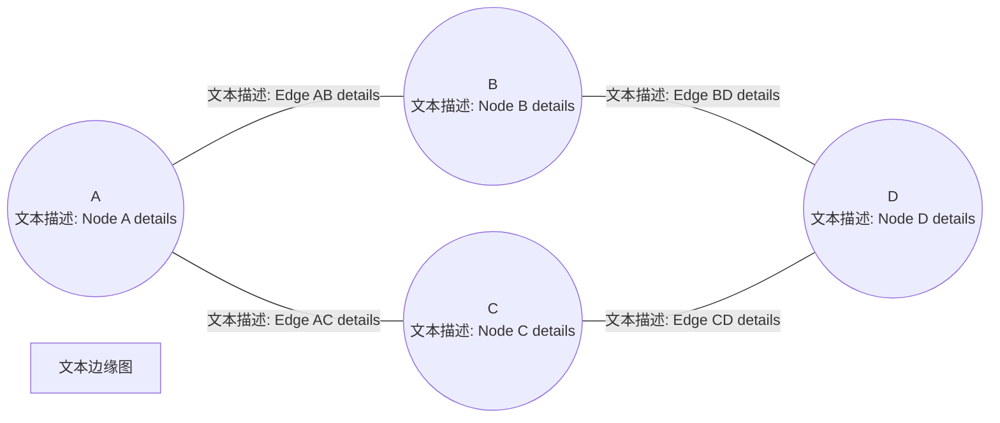

# Link Prediction of Textual Edge Graphs

## 摘要

文本边缘图(TEG, 边缘上具有富文本的网络)**封装了大量关系和上下文信息**。但是现有的研究方法分为**基于GNN**和**基于LLM**两类，都有些问题。本文提出一种新的框架(**LINK2DOC**)专门用于TEG上进行**链路预测**(预测两个节点之间是否存在链接)。

### 创新点

LINK2DOC 通过将节点对之间的邻居信息**总结为类人类编写的文档**，并**利用自监督学习模型**增强GNN的文本理解能力。

### 结论

在四个真实世界数据集上的实验表明，LINK2DOC 在链接预测任务中的表现优于现有的边缘感知GNNs和预训练语言模型。

## 研究问题

- 基于LLM的问题：容易丢失图形的结构信息
- 基于GNN的问题：无法解释TEG中可能发生的复杂交互

- 研究目标：提出一种新框架(LINK2DOC)，旨在解决现有方法的不足，更好的进行TEG上的链路预测。

## 研究方法

- LINK2DOC
  - **连贯的文档组合**，用通俗易懂的人话来描述节点对之间局部的拓扑信息，保留语义和拓扑信息
  - **自监督学习模块**，用自监督学习模型增强GNN语言处理能力

- 转换图
  - 用于捕捉和表示TEG中两个节点之间的所有可能的路径
  - 
  - **定义：**对于TEG中的任意两个实体(节点) $(s, t)$,从$s$到$t$的所有路径共同形成一个$(s, t)$的转换图，用$G(s, t)$表示。分别用$m$和$n$表示$G(s,t)$中的节点数和边数。路径长度上限可以用整数$K$来设定，通常可以将其设置为TEG的直径。
  - 构建方法：
    1. 广度优先搜索(BFS)
       - 从源节点$s$开始，执行BFS来探索到目标节点$t$的所有路径
       - BFS的深度可以设置为转换图直径的一半，以确保覆盖到足够的局部领域信息
    2. 提取局部结构
       - 提取源节点$s$和目标节点$t$的局部结构，分别记为$G_s$和$G_t$​
         - 分别对源节点$s$和目标节点$t$进行BFS，提取他们各自的深度为$L$的局部结构，
         - $s$进行BFS时，深度小于等于$L$(为了$G_s$和$G_t$都能各自覆盖其近邻信息以及足够数量的节点，$L$通常设置为$G(s,t)$直径的一半)就把节点染橙色(仅论文示意图)，$t$同理染成蓝色，两边都染色就成了两种颜色的节点
       - 
    3. 处理隐藏边
       - 在BFS树中，某些边可能不会被直接探索到（例如，由于搜索深度限制或边不存在于BFS树中）。
       - 识别这些隐藏边，并在转换图中适当地表示它们，以确保转换图的完整性。
    4. 合并转换图
       - 将$G_s$和$G_t$合并为一个完整的转换图$G(s, t)$,这个图包含了从$s$ 到$t$ 的所有路径和边
  
- 转换文档构建

  - 用于整合语义和拓扑信息

  - 

  - 构建方法：

    1. 先得到上一步的转换图$G(s,t)$

    2. 使用前序遍历来分别遍历$G_s$和$G_t$​中的节点，并为每个节点分配文档中的章节和小节序号，如下图

       

    3. 识别并添加那些在局部结构中不直接出现，但在转换图中存在的隐藏边

    4. 识别 $G_s$和 $G_t$ 中的共享节点，这些节点在转换文档中需要有交叉引用，以显示它们在不同局部结构中的连接

    5. 最终将$s$和$t$的局部结构段落合并为一个统一的文档，确保文档不仅描述孤立的节点，还突出了他们之间的相互连接。

       

- 自监督学习模块

  - 使用预训练模型PLM来处理转换文档$d_{(s,t)}$，以保持文本的完整性，得到文档的潜在表示$\widetilde h_{(s,t)} = f_{LM}(d_{(s,t)})$
  - 通过GNN处理转换图中的图结构和边文本信息，生成表示$h_{(s,t)} = g(f_{GNN}(G_s) \oplus f_{GNN}(G_t))$
  - 使用加权交叉熵损失对齐$\widetilde h$和$h$，$\ell_{KD} = -\mathbb{E}\left[\log \frac{\exp\left(sim(\widetilde h_{(s, t)}, h_{(s, t)})/\tau\right)}{\sum^K_{k=1}\exp\left(sim(h_{(s, t)}, h_{(s, k)})/\tau\right)}\right]$
  - 最终用于预测边属性图上的链接的LLM增强表示学习的总体目标写为$\ell = \lambda_1 \ell_{KD} + \lambda_2 \ell_{LP}$,其中$\lambda_1$和$\lambda_2$是超参数

- 时间复杂度

  - 训练：$O(2N+E+P^2+|E| \cdot f+N^2)$
  - 推理：$O(|E| \cdot f + N^2)$

